# LittleHorse Fault Tolerance & Retry Behavior on GKE
## CIS4330 — Final Project Phase 2 | Sara Riahi
---

## Overview

This hands-on submission explores how LittleHorse handles fault tolerance and automatic retry behavior in a microservices environment. Building on Phase 1, where my team introduced LittleHorse as a workflow orchestration engine, this phase moves beyond theory into actual implementation. I deployed LittleHorse on Google Kubernetes Engine (GKE), wrote a two-step order processing workflow in Python using the LittleHorse SDK, and purposely triggered task failures to observe how the workflow engine detects, tracks, and recovers from errors automatically. This work demonstrates one of LittleHorse's core value propositions: removing the burden of retry logic and failure handling from individual microservices and centralizing it in the workflow engine.

---

## Technology Used

- **Platform:** Google Kubernetes Engine (GKE)
- **Language:** Python 3.12
- **SDK:** littlehorse-client 1.0.2
- **CLI:** lhctl via Docker
- **Tools:** Cloud Shell, kubectl, Docker

---

## Codes Used

### [`register_tasks.py`](register_tasks.py)
Before registering a workflow, LittleHorse requires that all task definitions (TaskDefs) it references already exist on the server. This script registers two TaskDefs: validate-order and process-payment using placeholder functions that match the expected input signature. This separation essentially mirrors real microservices architecture where task definitions act like contracts between the workflow engine and the services that eventually execute them.

### [`register.py`](register.py)
This script defines the order-processing workflow using the LittleHorse Python SDK. The workflow consists of two steps: validating an order, then processing payment. The key architectural detail is retries=3 on the validate-order task. This is what tells LittleHorse to automatically retry that task up to three times before marking the workflow as failed. This is the core of the fault tolerance demonstration: retry logic is defined once at the workflow level, not duplicated across individual services.

### [`workers.py`](workers.py)
This script runs the actual task worker services that LittleHorse dispatches the work to. The validate_order worker raises an exception on the first two attempts to simulate a transient failure. This commonly occurs in distributed systems due to network timeouts, temporary database unavailability, or upstream service errors. On the third attempt, it succeeds. The process_payment worker only executes after validate_order succeeds, demonstrating LittleHorse's execution control. Both workers poll LittleHorse continuously, waiting for tasks to be assigned.

---

## Walkthrough and Screenshots

### Step 1 — GKE Cluster Creation
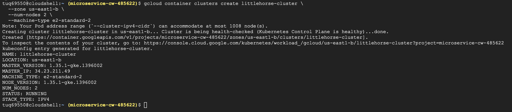

The first step was provisioning a GKE cluster named littlehorse-cluster in the us-east1-b zone using Google Cloud Shell. Running LittleHorse on GKE connects directly to the Kubernetes content covered throughout this course — LittleHorse is designed to run alongside microservices in a Kubernetes environment, acting as the workflow orchestration layer on top of the container orchestration layer. The cluster was configured with two e2-standard-2 nodes, providing sufficient resources to run the LittleHorse standalone server alongside the task worker pods.

---

### Step 2 — LoadBalancer Service and External IP
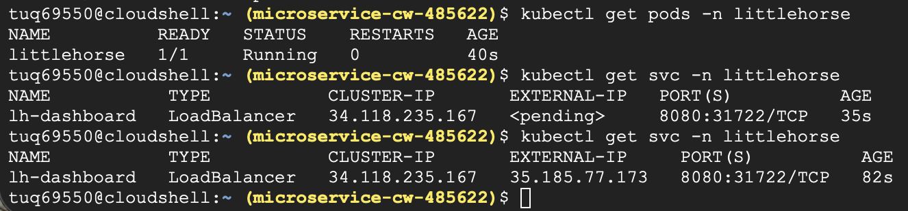

After deploying LittleHorse as a pod on the cluster, two LoadBalancer services were created to expose it externally — one for the dashboard on port 8080 and one for the gRPC API on port 2023. This screenshot shows the progression from <pending> to a resolved external IP address (35.185.77.173), which GKE assigns automatically by provisioning a Google Cloud Load Balancer. The separation of the dashboard port and the gRPC API port reflects LittleHorse's architecture: the dashboard is a human-facing interface while port 2023 is the machine-to-machine communication channel used by the Python SDK and worker services.

---

### Step 3 — LittleHorse Dashboard Running on GKE
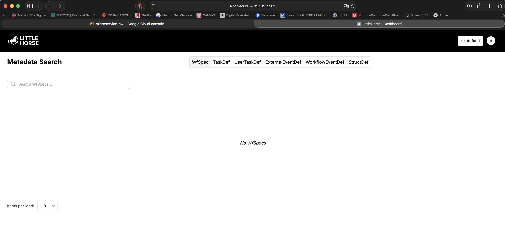

With the LoadBalancer IP in hand, the LittleHorse Dashboard became accessible at http://35.185.77.173:8080. The dashboard shows a Metadata Search interface with tabs for WfSpec, TaskDef, ExternalEventDef, and more, which is currently empty because no workflows have been registered yet. This confirms that LittleHorse is running successfully on GKE and ready to receive workflow definitions. The dashboard is one of LittleHorse's best features, providing real-time visibility into workflow state that would otherwise require custom monitoring in a traditional microservices setup.

---

### Step 4 — gRPC API Service Exposed
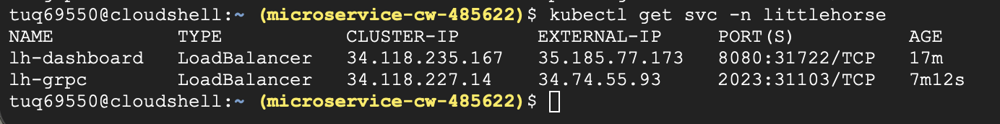

A second LoadBalancer service was created specifically for the gRPC API on port 2023, which is the port the Python SDK uses to communicate with the LittleHorse server. This screenshot shows the lh-grpc service receiving its external IP (34.74.55.93), which is distinct from the dashboard IP.

---

### Step 5 — Workflow Registered Successfully
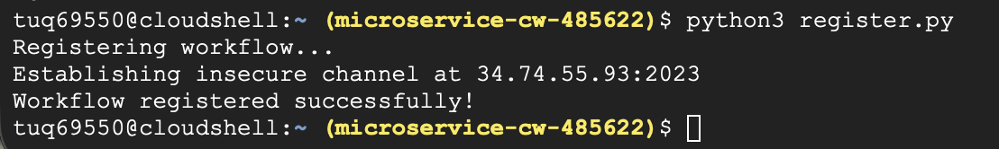

Running register.py against the live LittleHorse server produced a successful registration confirmation. The terminal shows the script connecting to the gRPC server at 34.74.55.93:2023 and registering the order-processing WfSpec. This step required first registering the TaskDefs via register_tasks.py, then registering the workflow that references them. The workflow engine needs to know about every task definition before it can validate a workflow that uses those tasks, enforcing a contract-first approach to distributed system design.

---

### Step 6 — Dashboard Confirms Workflow Registration
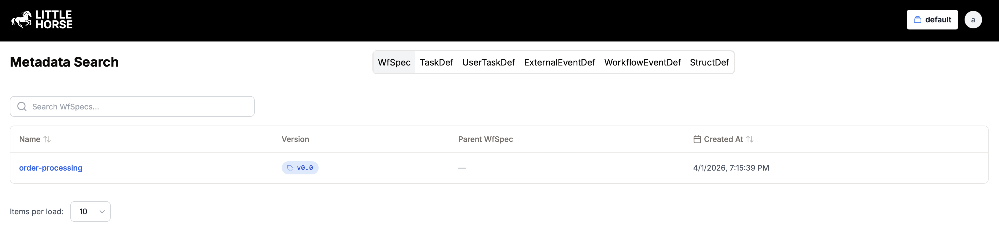

Refreshing the LittleHorse Dashboard after running register.py shows the order-processing WfSpec listed at version v0.0, created at 4/1/2026, 7:15:39 PM. This confirms that the workflow definition was successfully persisted by the LittleHorse server and is ready to be executed. When a workflow definition is updated and re-registered, LittleHorse creates a new version rather than overwriting the old one, allowing existing workflow runs to complete under their original definition while new runs use the updated version.

---

### Step 7 — Workflow Graph Visualization
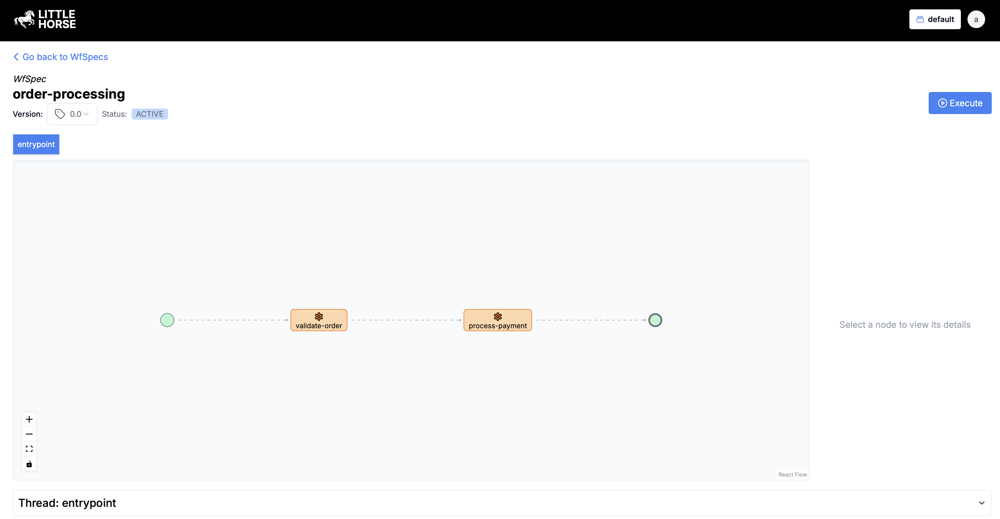

Clicking into the order-processing WfSpec reveals a visual graph of the workflow, showing the two task nodes: validate-order and process-payment. They are connected via the workflow entrypoint on the left and the completion node on the right. The Status shows ACTIVE, meaning the workflow is ready to accept new runs. This visual representation is automatically generated by LittleHorse from the Python workflow definition code, demonstrating how the SDK translates code into a structured computational graph that the engine can execute, monitor, and visualize without any need for additional configuration.

---

### Step 8 — Task Workers Connected and Listening
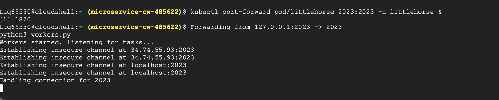

Running workers.py starts two long-running task worker processes that connect to the LittleHorse server and poll for tasks to execute. The terminal shows the workers establishing connections at 34.74.55.93:2023 and entering a listening state while waiting for LittleHorse to assign them work. A kubectl port-forward command was used here in order to bridge the internal cluster networking for the worker channel. Workers pull tasks from the server rather than being pushed to them, which means workers can be scaled independently and LittleHorse handles load distribution automatically.

---

### Step 9 — Workflow Run Triggered
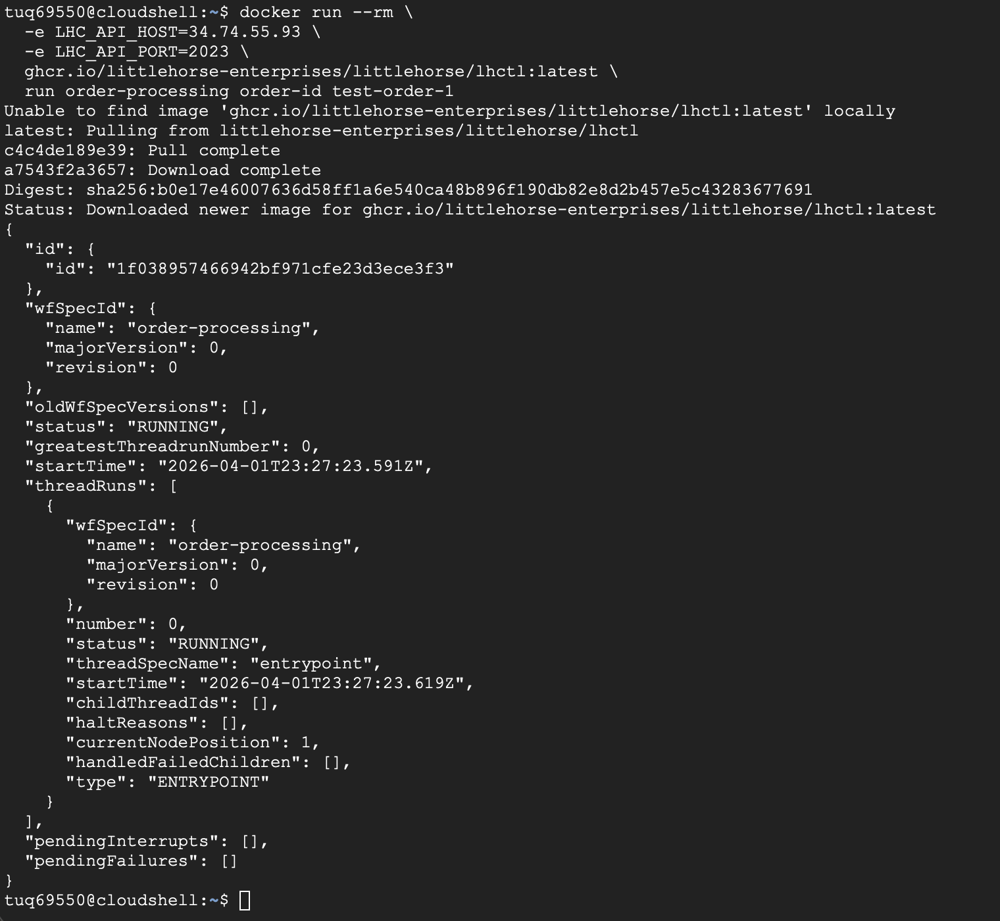

A workflow run was triggered using the lhctl CLI tool via Docker, passing test-order-1 as the order-id variable. The response JSON shows the new WfRun with status RUNNING, a unique run ID, and the workflow specification details. This proves that LittleHorse received the trigger, created a new WfRun instance, and began executing the workflow. The revision: 0 in the response indicates this run is using the FIRST version of the workflow definition, which is relevant because LittleHorse tracks which version of a WfSpec each run uses.

---

### Step 10 — First Attempt Fails, LittleHorse Detects the Error
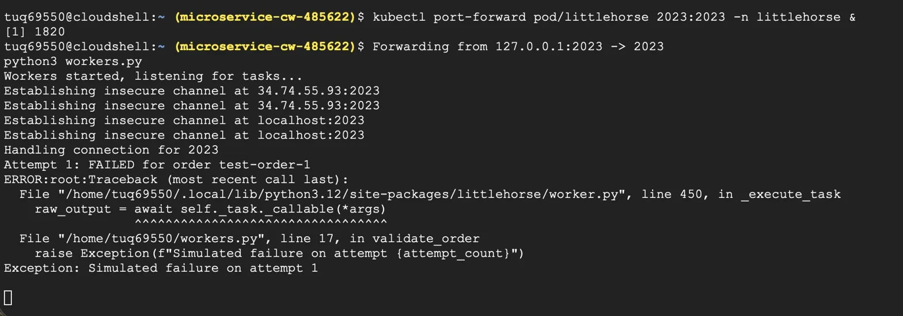

The workers tab immediately shows activity after the workflow was triggered. The worker raised an exception to simulate a transient service failure, and LittleHorse captured the error from the worker process, recorded it against the TaskRun, and began accessing the next action based on the retry configuration. In a traditional microservices setup without a workflow engine, this failure would need to be caught and handled by the calling service, requiring custom retry logic. However, LittleHorse handles it entirely at the orchestration layer.

---

### Step 11 — Workflow Enters ERROR State Without Retries
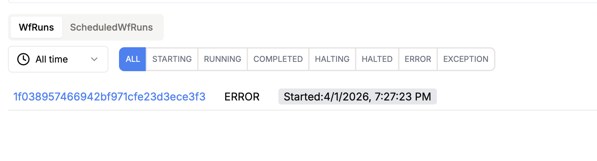

The first workflow run entered ERROR state because it was registered without the retries=3 parameter. This was an intentional first step in the demonstration to show what happens WITHOUT retry configuration. LittleHorse detected the task failure, recorded the error, and immediately marked the entire workflow run as ERROR since no retry policy was defined. This behavior illustrates the importance of explicitly configuring fault tolerance in workflow definitions, and shows that LittleHorse provides clear failure states rather than silently dropping failed tasks.

---

### Step 12 — WfRun Detail Shows Failure Isolation
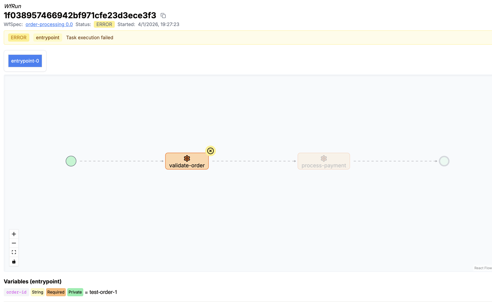

Looking into the failed WfRun reveals exactly where the failure had occurred. The workflow graph shows validate-order with a red error symbol, while process-payment is completely grayed out meaning it never executed because the first task failed. The error message reads "Task execution failed" and the variable order-id = test-order-1 confirms the exact input that triggered the failure. This is LittleHorse's failure isolation in action: when one task fails, the downstream tasks that depend on it are automatically halted, preventing the system from processing incomplete or invalid data through the rest of the workflow.

---

### Step 13 — Retry Behavior: Fails Twice, Succeeds on Third Attempt
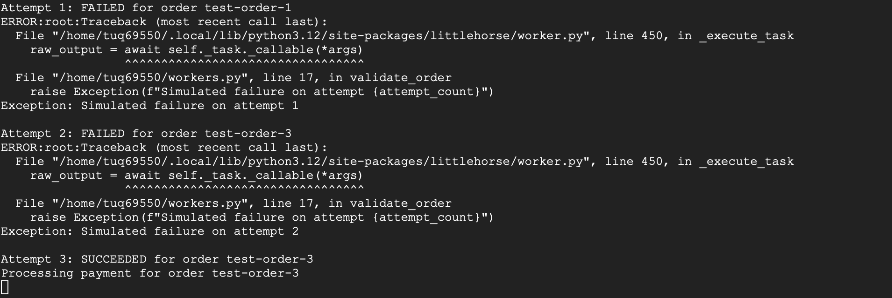

After updating register.py to include retries=3 and re-registering the workflow, a new run was triggered with test-order-3. The workers tab shows the complete retry sequence: Attempt 1 failed, Attempt 2 failed, and Attempt 3 succeeded — at which point process-payment was immediately executed. LittleHorse automatically scheduled and executed each retry without any intervention, tracking the attempt count and workflow state throughout. In a real distributed system, this kind of transient failure handling prevents temporary service disruptions from causing permanent data loss or incomplete business processes.

---

### Step 14 — Workflow Completes Successfully
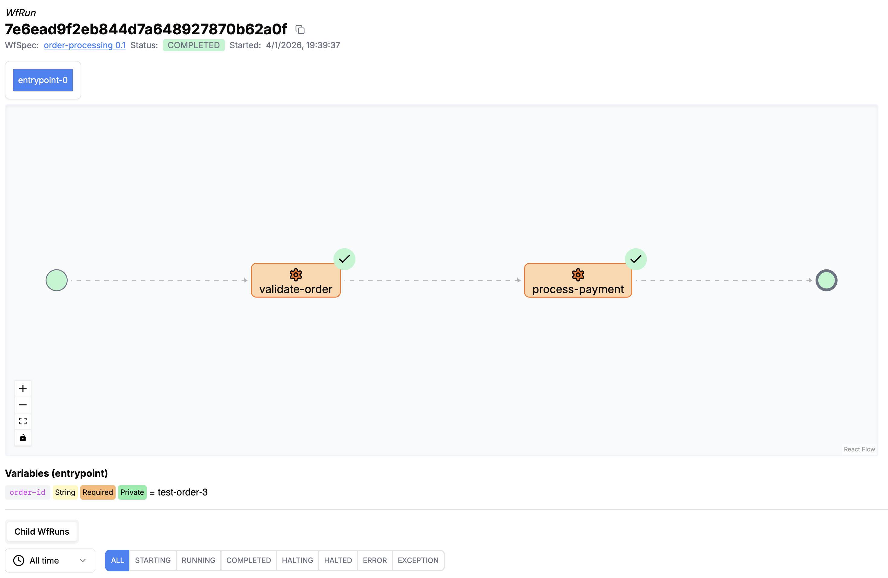

The LittleHorse Dashboard shows the final state of the test-order-3 workflow run with both validate-order and process-payment nodes displaying green checkmarks, and the overall status is completed. This screenshot represents the full cycle of a fault-tolerant workflow: triggered, failed, retried, recovered, and completed. This is all managed automatically by LittleHorse without any custom retry logic in the worker services themselves. The contrast between the ERROR state in step 11 and the "COMPLETED" state here portrays how retries=3 changes the system's behavior under failure conditions.

---

### Step 15 — Resource Cleanup
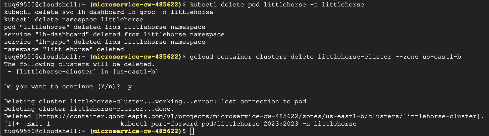

After completing the demonstration, all GKE resources were deleted to prevent ongoing cloud charges. The cleanup involved deleting the pod, services, namespace, and finally the cluster itself. The terminal confirms all resources were successfully deleted.

---

## Architectural Analysis

### How This Fits Into the Team's MSA Architecture
LittleHorse sits at the orchestration layer of a microservices architecture, above the container orchestration layer (Kubernetes) and below the business logic layer (individual services). My hands-on work demonstrates this by running LittleHorse on GKE. Kubernetes manages the containers while LittleHorse manages the workflow execution across those containers. This is consistent with what we presented in Phase 1: LittleHorse is NOT a replacement for Kubernetes, but a complement to it. It handles the coordination of business processes that span multiple services.

### Fault Tolerance Insights
One of the most significant architectural insights from this hands-on work is how LittleHorse externalizes retry logic from individual services. In a traditional microservices setup, each service would need to implement its own retry mechanism which often leads to duplicated code, inconsistent behavior, and complex debugging. By defining retries=3 at the workflow level, the retry policy becomes part of the process definition rather than scattered across service implementations.

### Challenges Encountered
Working with the LittleHorse Python SDK required significant trial and error throughout the implementation process. The SDK documentation for version 1.0.2 did not clearly outline the correct function signatures, method names, or the required order of operations for registering workflows. For example, early attempts to register the workflow failed because the TaskDefs needed to be registered first. This was not immediately obvious from reading the documentation alone. Additionally, method names like create_workflow_spec, create_task_def, and the retries parameter on wf.execute() were discovered by reading the SDK source code directly using Python's inspect module rather than from official guides. Several iterations of the code were required before each script executed correctly, with each error message revealing a new layer of the SDK's internal structure.

All three Python files (register_tasks.py, register.py, and workers.py) were written by hand based on the LittleHorse GitHub repository, official documentation, and the littlehorse-client PyPI package. The LittleHorse examples repository served as a starting point for understanding the general structure of workflows and workers, but the actual code was adapted and modified manually to fit this specific case. This was done by the order processing workflow with deliberate failure injection for the retry demonstration. 

Despite the difficulty, working through these issues gave me a much more grounded understanding of how LittleHorse operates internally, and how its SDK translates Python code into workflow specifications. 

### Recommendations
Based on my experience working through this hands-on project, I would recommend that anyone getting started with LittleHorse keep their first workflow as simple as possible, with two or three steps at most, before trying to tackle anything more complex like external events or parallel threads. I made the mistake of jumping straight into a multi-step workflow without fully understanding how task registration and worker polling worked first, and it made the debugging process a lot harder than it needed to be. Getting comfortable with the basics first would have saved a lot of time.
I would also strongly recommend using the LittleHorse Dashboard from the very beginning. When things were going wrong during my setup, being able to visually see which task node failed, what state the workflow was in, and whether the workers were even connected made troubleshooting way easier than trying to piece it together from terminal logs alone. The dashboard turns what could be a confusing debugging experience into something much more manageable, especially when you are still learning how the system actually works.

---

## References
- LittleHorse Documentation: https://littlehorse.io/docs
- LittleHorse GitHub: https://github.com/littlehorse-enterprises/littlehorse
- LittleHorse Python SDK (PyPI): https://pypi.org/project/littlehorse-client/
- LittleHorse Examples Repository: https://github.com/littlehorse-enterprises/lh-examples
